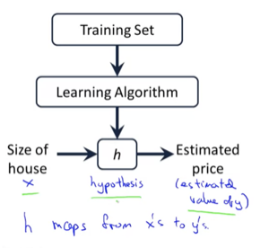
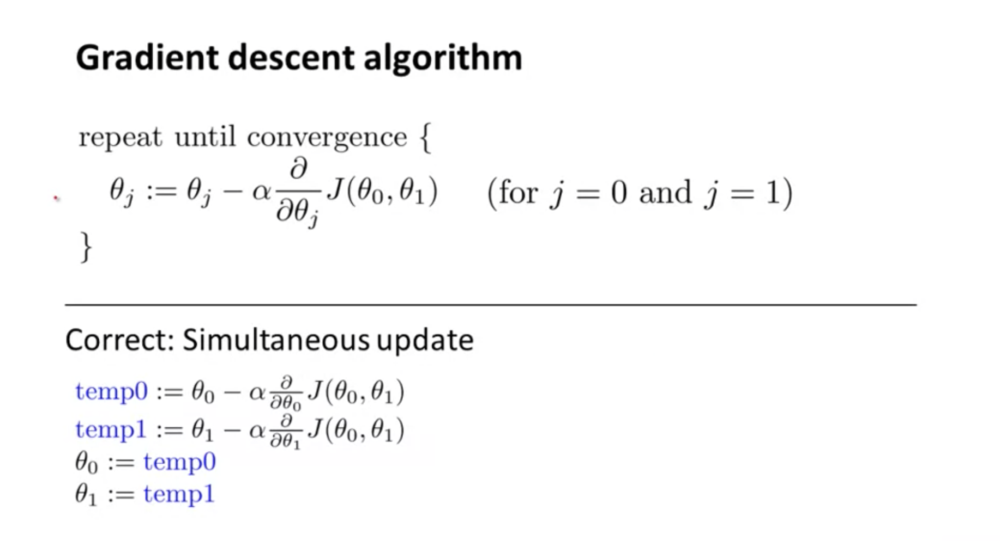
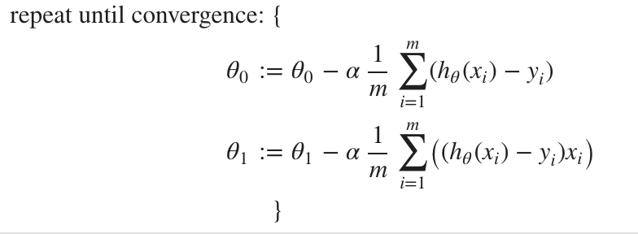
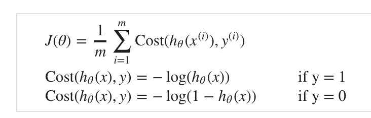
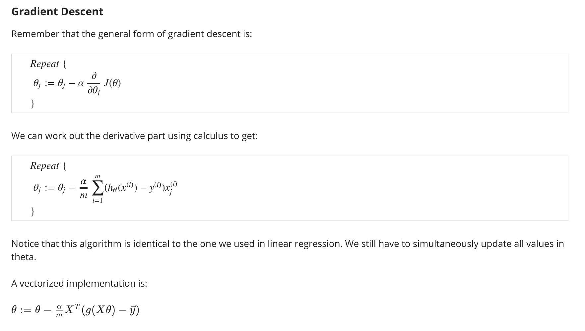
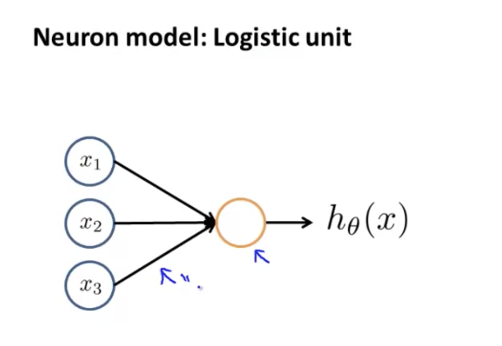
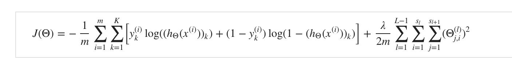
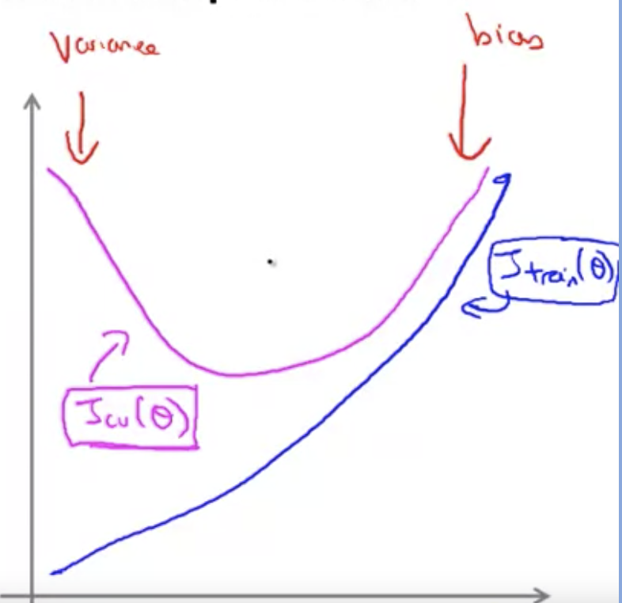
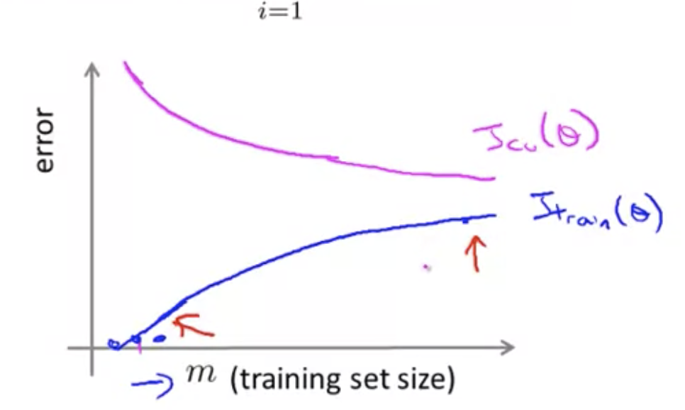

# Machine Learning [Coursera]

ML Examples

* Data mining
  * Web click data
  * Medical
  * Biology
  * Engineering

* Things you cant a program for
  * Hand writing recognition
  * NLP
  * Computer vision

* Self customizing programs

* Understanding human learning

## What machine learning

* Arthur samuel checkers playing program

* Definition : The computer program is said to learn form expirience E with respesct to task T and some performance P, if its performance on T as measured by P, improved with expirience E

* Main types are supervised learning and unsuperised learning

* Other are reinforcement learning and recommender systems

## Supervised learning

* Given data and machine comes up with an algorithm
* Regression : Predict continous valued output.
* Classfication: Predict the output

## Unsupervised learning

* Clustering

## Model

* m = number of training examples 
* x's = input variables or features
* y's = output variable or target value
* (x, y) =  single training example
* $x^{(i)}, y^{(i)}$ = ith training example

## Cost function

### Linear regression model or Univariant regression model

The given equation is a straight line.

$h_\theta(x) = \theta_0 + \theta_1x$

$\theta_0, \theta_1$ are parameters

We try to draw a straight which best fits the data by trying to minimize the cost function

 $J(\theta_0, \theta_1) =\frac{1}{2m} \sum_{i=1}^{m}\big(h_\theta(x^{(i)}) - y^{(i)}\big)$

Contour plots can be used to project 3d figures in 2d plane

## Gradient descent

## Multivariant regression model

$$
\Theta = 
\begin{bmatrix}
   \theta_0 \\
   \theta_1 \\
   \theta_2 \\
   ... \\
   \theta_n
\end{bmatrix}

X = 
\begin{bmatrix}
   1 \\
   x_1 \\
   x_2 \\
   ... \\
   x_n
\end{bmatrix}
$$

$$
h_\theta(x) = \Theta^TX
$$

## Feature scaling

* Make sure the features are on similar scale

## Choosing $\alpha$

### Mean normalization

$x_i = \frac{x_i - \mu_i}{max (x) - min(x)}$

## Normal equation

$\theta = \lparen X^TX \rparen ^{-1}X^Ty$

## Classification

### Logistic regression

Hypothesis

$$
h_\theta(X = g(\theta^TX)
$$

Sigmoid function

$$
g(z) = \frac{1}{1 + e^{-z}}
$$

Finally

$$
h_\theta(X) = \frac{1}{1 + e^{-\theta^TX}}
$$

### Cost function

### Gradient descent

## Under fitting and over fitting

## Regularization

## Neural networks

In linear regression, we find the best fit for $\theta$ such the given features form polynomial figure the classifies or fits a given data set. Further we can on our own create features by combining existing features.

The features combinations can be easily explode and this would be complex to solve linear hypothesis. Thus the need for non linear hyposthesis.

### Cost function

### Back propagation

### Gradient checking

## Evaluating a machine learning algorithm

### Debugging

* Collect more training data
* Try smaller set of features
* Try getting additional features
* Try adding polynomial features
* Modify $\lambda$

### Machine learning diagnostic

* Avoid overfitting

#### Evaluating the hypothesis

* Split the training data to 70 : 30, to have some data for testing
* Training set, cross validation set and testing set

### Model selection

* What degree of polynomial ? Try different values

### Bias or variance

* Bias : High bias underfit the data
* Variance : High variance overfit the data

#### Regularization

Try different values 

## Learning curves

